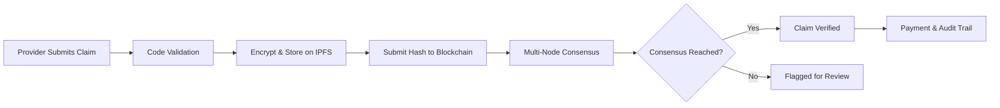

# Decentralized Healthcare Claims Verification Network

A blockchain-based infrastructure for verifying healthcare claims across multiple providers through distributed consensus, cryptographic proofs, and off-chain computation.

## Quick Start

```bash
# Clone the repository
git clone <repository-url>
cd apx

# Start the frontend (Next.js)
cd frontend
npm install
npm run dev

# Start the backend (Go)
cd ../backend
go mod download
go run main.go

# The application will be available at http://localhost:3000
```

## What Is This?

**APX** is a decentralized healthcare claims verification network that solves critical problems in healthcare administration:

- **Slow Processing**: Traditional claims take 2-4 weeks. APX verifies claims in 1-2 hours.
- **High Costs**: Billions spent on administrative overhead. APX reduces costs by 60-80%.
- **Fraud Risk**: Centralized systems are vulnerable. APX uses consensus to prevent fraud.
- **Lack of Transparency**: Providers can't track claims. APX provides real-time visibility.

## Problem Statement

The healthcare industry processes billions of insurance claims annually, with verification processes that are slow, expensive, and prone to fraud. Traditional centralized systems create bottlenecks, lack transparency, and suffer from information asymmetry between providers, insurers, and patients. This application addresses these systemic issues by building a trustless, transparent, and efficient claims verification network where multiple stakeholders can reach consensus on claim validity without relying on a single intermediary.

## Benefits to Healthcare Systems

### Fraud Reduction
Distributed consensus mechanisms and provider reputation scoring make fraudulent claims significantly harder to execute. The immutable audit trail on-chain ensures all claim modifications are permanently recorded and verifiable.

### Cost Efficiency
By eliminating intermediary overhead and automating verification through smart contracts and off-chain computation, the system reduces administrative costs associated with claims processing. Off-chain data storage via IPFS minimizes on-chain transaction costs while maintaining security guarantees.

### Accelerated Processing
Multi-node consensus and parallel verification across providers drastically reduce claim processing times from weeks to hours or minutes, improving cash flow for healthcare providers and reducing patient billing uncertainty.

### Transparency and Trust
All stakeholders gain visibility into the verification process through blockchain transparency. Patients can track claim status, providers can verify legitimacy, and insurers can audit the entire process without proprietary systems.

### Interoperability
The decentralized network enables seamless data sharing across different healthcare systems, insurance networks, and geographic regions while maintaining privacy and compliance standards.

## How It Works

### Workflow Overview



### Step-by-Step Process

1. **Provider Submits Claim**: Healthcare provider submits claim with medical codes (CPT, ICD-10), NPI number, service date, amount, and supporting documents.

2. **Automated Code Validation**: System automatically validates CPT procedure codes, ICD-10 diagnosis codes, and NPI provider identifiers against industry standards.

3. **Encrypted Storage on IPFS**: Sensitive claim data and documents are encrypted (AES-256-GCM) and stored on IPFS (InterPlanetary File System) for decentralized, secure storage.

4. **Hash Submitted to Blockchain**: A Keccak256 hash of the claim data is submitted to the blockchain. Patient data never touches the blockchain—only the hash for verification.

5. **Multi-Node Consensus**: Multiple validator nodes independently review the claim. They reach consensus through a distributed voting mechanism (typically requiring 4 out of 5 approvals).

6. **Claim Verified**: Once consensus threshold is met, the claim is marked as verified on-chain. Status is immediately visible to all parties.

7. **Payment & Audit Trail**: Provider receives payment. All parties have access to a transparent, immutable audit trail of the entire verification process.

## Technical Architecture

### Blockchain Layer (Solidity)
- Smart contracts manage claim submission, verification logic, and state transitions
- Keccak256 hash verification ensures claim data integrity without exposing sensitive information on-chain
- Multi-signature consensus mechanism requires multiple verifiers to approve claims
- Provider reputation contracts track historical accuracy and performance with on-chain staking

### Backend Infrastructure (Go)
- High-performance consensus nodes validate claims across the network
- IPFS integration for decentralized storage of sensitive claim documents
- Off-chain computation engines process complex verification logic
- Blockchain synchronization services maintain network state consistency

### Frontend Interface (Next.js/TypeScript)
- Provider dashboard for claim submission and status tracking
- Interactive verification workflow with real-time consensus updates
- Reputation score visualization and historical claim analytics
- RESTful API integration for backend communication

## Key Features

### Multi-Node Consensus
Distributed validators collectively verify claims without central authority, ensuring no single point of failure or manipulation. A minimum threshold of verifier approvals (typically 4 out of 5) is required before claims are finalized.

**Real-World Impact**: Prevents fraud by requiring multiple independent validations, eliminating single points of failure.

### Cryptographic Hash Verification
Keccak256 hashing allows efficient verification of claim data integrity without exposing sensitive patient information on-chain. Full claim data is stored encrypted on IPFS with only hashes recorded on the blockchain.

**Real-World Impact**: Maintains HIPAA compliance while providing verifiable integrity of claim data.

### Automated Validation Rules
Complex verification algorithms validate CPT procedure codes, ICD-10 diagnosis codes, NPI provider identifiers, service dates, and claim amounts against industry standards before submission to verifiers.

**Real-World Impact**: Reduces processing time from weeks to hours by automating manual verification tasks.

### Blockchain Synchronization
Nodes maintain eventual consistency across the network, with conflict resolution mechanisms for handling competing claim states.

**Real-World Impact**: Ensures all parties see the same claim status, eliminating disputes and confusion.

### IPFS Pinning
Medical documents, imaging, and supporting evidence are stored on IPFS with content-addressed hashes anchored on-chain for verification.

**Real-World Impact**: Decentralized storage reduces costs while maintaining security and accessibility.

### Off-Chain Computation
Complex verification algorithms run off-chain with results posted on-chain, balancing computational efficiency with trust guarantees.

**Real-World Impact**: Enables complex validation logic without expensive on-chain gas costs.

### Distributed Claim State
Claim status is maintained across multiple nodes, preventing data loss and ensuring availability even during network partitions.

**Real-World Impact**: High availability ensures claims processing continues even if individual nodes fail.

### Provider Reputation Scores
Historical claim accuracy and network participation are tracked on-chain, creating economic incentives for honest behavior.

**Real-World Impact**: Providers with high reputation scores get faster processing and lower fees, incentivizing accuracy.

## Technology Stack

- **Smart Contracts**: Solidity for Ethereum-compatible chains (Foundry framework)
- **Backend Services**: Go for high-performance consensus and verification nodes
- **API Layer**: RESTful API with Gin framework for claim submission and validation
- **Frontend Dashboard**: TypeScript/Next.js for provider interfaces
- **Storage Layer**: IPFS for decentralized document storage with AES-256-GCM encryption
- **State Management**: Distributed ledger with event-based synchronization

## Getting Started for Developers

### Prerequisites

- Node.js 18+ and npm
- Go 1.21+
- Foundry (for smart contract development)
- IPFS node (or use Infura/Pinata)

### Development Setup

1. **Clone and Install**
   ```bash
   git clone <repository-url>
   cd apx
   ```

2. **Frontend Setup**
   ```bash
   cd frontend
   npm install
   cp .env.local.example .env.local
   # Edit .env.local with your configuration
   npm run dev
   ```

3. **Backend Setup**
   ```bash
   cd backend
   go mod download
   # Configure your .env file
   go run main.go
   ```

4. **Smart Contracts**
   ```bash
   cd contracts
   forge install
   forge build
   forge test
   ```

### Demo Mode

The application includes a comprehensive demo mode for testing and portfolio showcase:

```bash
# Enable demo mode in frontend/.env.local
NEXT_PUBLIC_DEMO_MODE=true
```

See `frontend/lib/implementation_guide.md` for detailed demo mode documentation.

## Use Cases

- Insurance claim verification across multiple provider networks
- Cross-border medical service claims with multi-jurisdictional validation
- Real-time fraud detection through consensus-based anomaly identification
- Audit trail generation for regulatory compliance and dispute resolution
- Provider credential verification and reputation-based network participation

## Future Enhancements

### Optimistic Rollup Integration
Implement Layer 2 optimistic rollup architecture to batch multiple claim verifications into single on-chain transactions, dramatically reducing gas costs while maintaining security through fraud proofs. This will enable processing thousands of claims with minimal on-chain footprint.

### Merkle Tree Proof System
Replace individual hash verification with Merkle tree-based proofs, allowing efficient verification of large claim batches. Providers could submit Merkle roots representing multiple claims, with individual proofs generated only when needed for disputes or audits.

### Zero-Knowledge Proofs
Integrate zk-SNARKs or zk-STARKs to enable privacy-preserving claim verification where validators can confirm claim validity without accessing sensitive patient data, even in encrypted form.

### Cross-Chain Bridge
Develop bridges to other blockchain networks, enabling claims verification across different chains and expanding interoperability with various insurance and healthcare systems.

### Machine Learning Fraud Detection
Enhance the off-chain validation layer with ML models trained on historical claim patterns to automatically flag suspicious claims for additional scrutiny before on-chain submission.

### Provider Dashboard UI
Complete the TypeScript/Next.js frontend application with comprehensive provider dashboard, real-time claim tracking, reputation analytics, and mobile-responsive design.

## Impact on Global Healthcare

This system democratizes access to efficient claims processing, particularly benefiting underserved regions where traditional insurance infrastructure is weak or absent. By reducing costs and increasing transparency, the network makes healthcare more affordable and accessible while maintaining the highest standards of data security and patient privacy.

