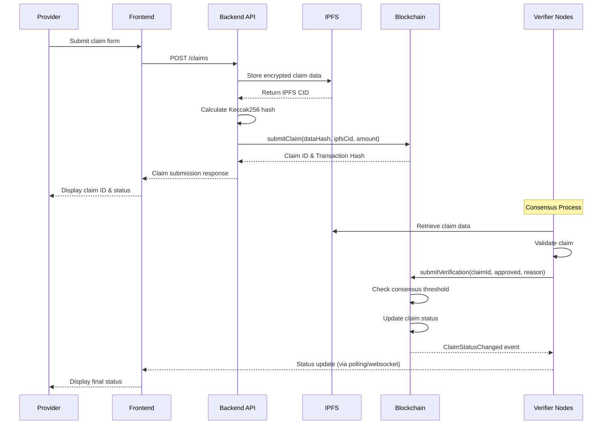

# APX Architecture Documentation

## Overview

APX (Decentralized Healthcare Claims Verification Network) is a multi-layer blockchain-based system designed to verify healthcare claims through distributed consensus, cryptographic proofs, and off-chain computation. This document describes the system architecture, data flow, and component interactions.

## System Architecture

### High-Level Architecture

```
┌─────────────────────────────────────────────────────────────────┐
│                         Frontend Layer                          │
│  Next.js 16 | React 19 | TypeScript | Tailwind CSS             │
│  - Provider Dashboard                                            │
│  - Claim Submission Interface                                    │
│  - Real-time Status Tracking                                     │
│  - Reputation Visualization                                      │
└────────────────────┬────────────────────────────────────────────┘
                     │ REST API
┌────────────────────▼────────────────────────────────────────────┐
│                      Backend Layer                               │
│  Go | Gin Framework | IPFS | Ethereum Client                    │
│  ┌──────────────────────────────────────────────────────────┐  │
│  │  API Handlers (REST Endpoints)                           │  │
│  │  - /claims (POST, GET)                                   │  │
│  │  - /providers (GET, LIST)                                │  │
│  │  - /claims/validate (POST)                                │  │
│  └──────────────────┬─────────────────────────────────────────┘  │
│  ┌──────────────────▼─────────────────────────────────────────┐ │
│  │  Verifier Node (Consensus Engine)                          │ │
│  │  - Multi-node consensus                                    │ │
│  │  - Claim validation logic                                  │ │
│  │  - Byzantine fault tolerance                               │ │
│  └──────────────────┬─────────────────────────────────────────┘ │
│  ┌──────────────────▼─────────────────────────────────────────┐ │
│  │  Ethereum Service                                          │ │
│  │  - Smart contract interaction                              │ │
│  │  - Transaction management                                  │ │
│  │  - Event listening                                         │ │
│  └──────────────────┬─────────────────────────────────────────┘ │
│  ┌──────────────────▼─────────────────────────────────────────┐ │
│  │  IPFS Service                                              │ │
│  │  - Encrypted document storage                             │ │
│  │  - Content addressing                                      │ │
│  │  - Gateway integration                                     │ │
│  └────────────────────────────────────────────────────────────┘ │
└────────────────────┬────────────────────────────────────────────┘
                     │ JSON-RPC / Web3
┌────────────────────▼────────────────────────────────────────────┐
│                    Blockchain Layer                             │
│  Ethereum-Compatible Chain (Sepolia Testnet)                    │
│  ┌──────────────────────────────────────────────────────────┐  │
│  │  ClaimsRegistry.sol                                      │  │
│  │  - Claim submission & lifecycle                          │  │
│  │  - Multi-signature verification                          │  │
│  │  - Status management                                     │  │
│  └──────────────────────────────────────────────────────────┘  │
│  ┌──────────────────────────────────────────────────────────┐  │
│  │  ProviderRegistry.sol                                   │  │
│  │  - Provider registration                                 │  │
│  │  - Reputation tracking                                   │  │
│  │  - Staking mechanism                                     │  │
│  └──────────────────────────────────────────────────────────┘  │
└─────────────────────────────────────────────────────────────────┘
                     │
┌────────────────────▼────────────────────────────────────────────┐
│                    Storage Layer                                 │
│  IPFS Network                                                    │
│  - Encrypted claim documents                                    │
│  - Supporting files                                              │
│  - Content-addressed storage                                    │
└─────────────────────────────────────────────────────────────────┘
```

## Component Details

### 1. Frontend Layer

**Technology Stack:**
- Next.js 16 (App Router)
- React 19
- TypeScript
- Tailwind CSS

**Key Components:**
- **Dashboard**: Provider claim management interface
- **Claim Submission**: Form-based claim entry with validation
- **Status Tracking**: Real-time claim status updates
- **Reputation Display**: Provider reputation score visualization

**Architecture Patterns:**
- Server Components by default for performance
- Client Components only when needed (interactivity)
- Dynamic imports for code splitting
- API route handlers for backend communication

### 2. Backend Layer

**Technology Stack:**
- Go 1.24.0
- Gin Web Framework
- Ethereum Go Client (go-ethereum v1.16.7)
- IPFS HTTP API Client

**Core Services:**

#### API Handlers (`backend/internal/api/handlers.go`)
- RESTful API endpoints
- Request validation and sanitization
- Response formatting
- Error handling

#### Verifier Node (`backend/internal/verifier/node.go`)
- Consensus algorithm implementation
- Multi-node coordination
- Claim validation logic
- Byzantine fault tolerance

#### Ethereum Service (`backend/internal/ethereum/service.go`)
- Smart contract interaction
- Transaction submission
- Event monitoring
- State synchronization

#### IPFS Service (`backend/internal/ipfs/service.go`)
- Document storage and retrieval
- AES-256-GCM encryption
- Content addressing
- Gateway URL generation

### 3. Blockchain Layer

**Smart Contracts:**

#### ClaimsRegistry.sol
- Manages claim lifecycle (Submitted → UnderReview → Approved/Rejected)
- Multi-signature verification mechanism
- Hash-based data integrity verification
- Event emission for off-chain indexing

#### ProviderRegistry.sol
- Provider registration and status management
- Reputation scoring system (0-100 scale)
- Staking mechanism with slashing
- Claim result tracking

**Security Features:**
- OpenZeppelin AccessControl for role-based permissions
- ReentrancyGuard protection
- Pausable functionality for emergency stops
- Input validation and bounds checking

### 4. Storage Layer

**IPFS Integration:**
- Decentralized content-addressed storage
- AES-256-GCM encryption for sensitive data
- Gateway access for HTTP retrieval
- Pinning service integration (optional)

## Data Flow

### Claim Submission Flow



### Verification Consensus Flow

```
1. Claim Submitted
   └─> Status: Submitted
   └─> Emits: ClaimSubmitted event

2. First Verifier Reviews
   └─> Status: UnderReview
   └─> Emits: ClaimVerificationSubmitted event

3. Additional Verifiers Review
   └─> Each emits: ClaimVerificationSubmitted event
   └─> Tracks: approvalsCount, rejectionsCount

4. Consensus Threshold Met
   └─> Minimum 2 verifications required
   └─> Majority vote determines outcome
   └─> Status: Approved OR Rejected
   └─> Emits: ClaimStatusChanged event
   └─> Updates: Provider reputation

5. Final State
   └─> Status: Approved/Rejected/Disputed/Expired
   └─> Immutable on-chain record
```

## Consensus Mechanism

### Multi-Node Consensus

**Verification Threshold:**
- Minimum 2 verifiers required
- Majority vote determines outcome
- Ties prevent automatic finalization (requires admin intervention)

**Verification Window:**
- 7 days from submission
- Claims expire if not verified within window
- Expired claims can be resubmitted

**Byzantine Fault Tolerance:**
- System tolerates up to (n-1)/3 malicious nodes
- Each verifier independently validates claims
- Consensus reached through transparent voting

**Reputation System:**
- Providers start with 50/100 reputation
- +1 point per approved claim
- -2 points per rejected claim
- Reputation affects processing priority

## Security Architecture

### Data Privacy

**On-Chain:**
- Only Keccak256 hash of claim data stored
- No patient PII on blockchain
- Provider addresses pseudonymized

**Off-Chain (IPFS):**
- AES-256-GCM encryption for sensitive fields
- Content-addressed storage (immutable)
- Access controlled through encryption keys

### Access Control

**Smart Contract Roles:**
- `DEFAULT_ADMIN_ROLE`: Full system control
- `ADMIN_ROLE`: Operational management
- `VERIFIER_ROLE`: Claim verification authority

**Provider Status:**
- `Pending`: Awaiting activation
- `Active`: Can submit claims
- `Suspended`: Temporarily disabled
- `Revoked`: Permanently disabled

### Threat Mitigation

**Reentrancy Protection:**
- OpenZeppelin ReentrancyGuard on critical functions
- Checks-effects-interactions pattern

**Input Validation:**
- Bounds checking on all numeric inputs
- String length limits
- Address validation

**Rate Limiting:**
- API-level rate limiting (to be implemented)
- Per-provider claim submission limits
- Verification window prevents spam

## Network Topology

### Node Communication

```
┌─────────────┐      ┌─────────────┐      ┌─────────────┐
│  Verifier   │      │  Verifier   │      │  Verifier   │
│   Node 1    │◄────►│   Node 2    │◄────►│   Node 3    │
└──────┬──────┘      └──────┬──────┘      └──────┬──────┘
       │                    │                    │
       └────────────────────┼────────────────────┘
                            │
                   ┌────────▼────────┐
                   │   Blockchain    │
                   │   (Ethereum)    │
                   └─────────────────┘
```

**Communication Patterns:**
- Event-driven: Nodes listen to blockchain events
- Polling: Periodic status checks
- Direct: API calls between nodes (future)

## Scalability Considerations

### Current Limitations

**Blockchain:**
- Gas costs scale with transaction volume
- Block confirmation times (12-15s on Ethereum)
- Storage costs for on-chain data

**IPFS:**
- Retrieval latency depends on network
- Pinning required for persistence
- Gateway rate limits

**Backend:**
- Single-node consensus implementation
- No horizontal scaling yet
- Database not yet implemented

### Future Enhancements

**Layer 2 Solutions:**
- Optimistic rollups for batch processing
- Zero-knowledge proofs for privacy
- Sidechains for lower costs

**Off-Chain Indexing:**
- The Graph protocol for efficient queries
- Event indexing service
- Caching layer for frequently accessed data

**Horizontal Scaling:**
- Multiple verifier nodes
- Load-balanced API servers
- Distributed IPFS nodes

## Deployment Architecture

### Development Environment

```
┌──────────────┐
│   Frontend   │  localhost:3000
│   (Next.js)  │
└──────┬───────┘
       │
┌──────▼───────┐
│   Backend    │  localhost:8080
│     (Go)     │
└──────┬───────┘
       │
┌──────▼───────┐
│  Local IPFS  │  localhost:5001
│     Node     │
└──────┬───────┘
       │
┌──────▼───────┐
│  Hardhat     │  localhost:8545
│   Network    │
└──────────────┘
```

### Production Environment

```
┌─────────────────────────────────────────┐
│         Load Balancer (Nginx)           │
└──────┬──────────────────┬───────────────┘
       │                  │
┌──────▼──────┐    ┌──────▼──────┐
│  Frontend   │    │  Frontend   │
│   (Vercel)  │    │   (Vercel)   │
└─────────────┘    └──────────────┘
       │                  │
       └──────────┬───────┘
                  │
         ┌────────▼────────┐
         │   API Gateway   │
         └────────┬────────┘
                  │
    ┌─────────────┼─────────────┐
    │             │             │
┌───▼────┐   ┌───▼────┐   ┌───▼────┐
│ Backend│   │ Backend│   │ Backend│
│  Node 1│   │  Node 2│   │  Node 3│
└───┬────┘   └───┬────┘   └───┬────┘
    │            │            │
    └────────────┼────────────┘
                 │
    ┌────────────┼────────────┐
    │            │            │
┌───▼────┐  ┌───▼────┐  ┌───▼────┐
│  IPFS  │  │  IPFS  │  │  IPFS  │
│  Node  │  │  Node  │  │  Node  │
└────────┘  └────────┘  └────────┘
    │            │            │
    └────────────┼────────────┘
                 │
         ┌───────▼────────┐
         │   Ethereum     │
         │   (Sepolia)    │
         └────────────────┘
```

## Monitoring & Observability

### Metrics to Track

**System Health:**
- API response times
- Error rates by endpoint
- Blockchain connection status
- IPFS node availability

**Business Metrics:**
- Claims submitted per day
- Average verification time
- Approval/rejection rates
- Provider reputation distribution

**Performance Metrics:**
- Gas costs per transaction
- IPFS storage/retrieval latency
- Consensus algorithm execution time
- Database query performance

### Logging Strategy

**Structured Logging:**
- JSON format for machine parsing
- Correlation IDs for request tracking
- Log levels: DEBUG, INFO, WARN, ERROR
- Sensitive data redaction

**Log Aggregation:**
- Centralized log collection (future)
- Real-time alerting on errors
- Historical analysis and trends

## Error Handling

### Error Propagation

```
Frontend → Backend API → Ethereum Service → Smart Contract
   │            │              │                  │
   └────────────┴──────────────┴──────────────────┘
                    │
            Error Response
            (HTTP Status + Message)
```

### Error Categories

**Client Errors (4xx):**
- Invalid request format
- Missing required fields
- Unauthorized access
- Resource not found

**Server Errors (5xx):**
- Blockchain connection failure
- IPFS storage failure
- Internal processing errors
- Timeout errors

**Blockchain Errors:**
- Insufficient gas
- Transaction reverted
- Network congestion
- Contract state errors

## Future Architecture Enhancements

### Planned Improvements

1. **Database Layer**
   - PostgreSQL for relational data
   - Redis for caching
   - Time-series DB for metrics

2. **Message Queue**
   - RabbitMQ/Kafka for async processing
   - Event-driven architecture
   - Retry mechanisms

3. **API Gateway**
   - Rate limiting
   - Authentication/authorization
   - Request/response transformation

4. **Monitoring Stack**
   - Prometheus for metrics
   - Grafana for visualization
   - ELK stack for logging

5. **CI/CD Pipeline**
   - Automated testing
   - Security scanning
   - Deployment automation

## References

- [API Documentation](./API.md)
- [Smart Contracts Documentation](./SMART_CONTRACTS.md)
- [Integration Guide](./INTEGRATION.md)
- [README.md](../README.md)

